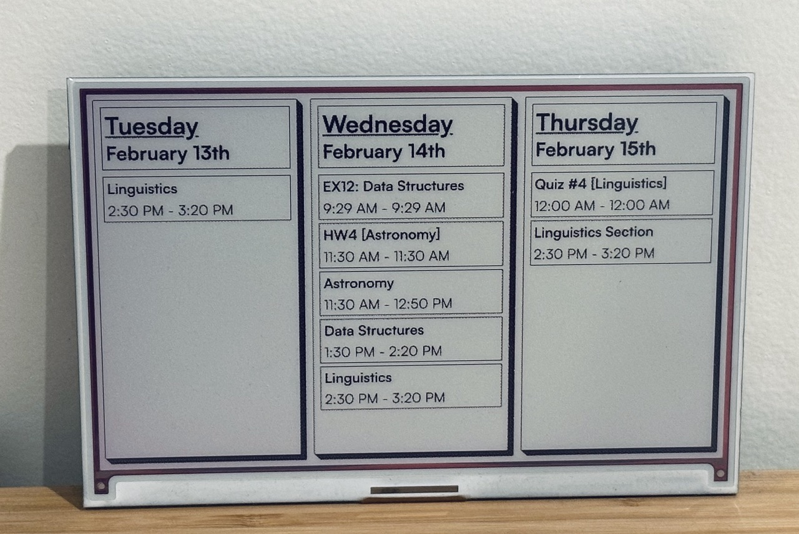

## Viam Inky Display Controller

This module provides an interface for controlling a Pimoroni Inky Impression e-paper display through Viam!

It encapsulates the fundamentals such as setting an image, modifying border color, manipulating individual pixels, and fetching the display's resolution. 

Inky is a generic component, and as such must be controlled through the `DoCommand` API.

 E.g.
```javascript
my_command = {
  "command": "dosomething",
  "someparameter": 52
}

await inky.do_command(my_command)
```

### Available Commands
By default, commands will only update the display buffer. For changes to appear, the `show` command will flush the buffer and refresh the screen. 

`set_image`: Sets the display image. Requires a base64 encoded string of the image.

```javascript
{
    command: "set_image",
    image: "<b64 encoded image>"
}
```

`set_border`: Sets the border color of the display. Requires an integer representing the color.
- Integer values depend on the exact Inky display. Valid inputs can be found in the corresponding [`inky*.py` file within the Pimoroni Inky repository.](https://github.com/pimoroni/inky/blob/main/library/inky/)

```javascript
{
    command: "set_border",
    color: 0
}
```

`set_pixels`: Sets individual pixels on the display.
- Each entry in the list is an array of values in the format `[x, y, v]`, where `v` represents the color value. 

```javascript
{
    command: "set_pixels",
    pixels: [[0, 0, 0], [0, 1, 0], ...]
}
```

`get_resolution`: Returns the current resolution as an object with `width` and `height`.

```javascript
{
    command: "get_resolution"
}
// Returns
{
    width: 800,
    height: 480
}
```

`show`: Flushes the buffer, applying all pending changes to the display.
```javascript
{
    command: "show"
}
```

## Example Usage

An example project, Inky Cal, making use of this module [can be found here!](https://github.com/agavram/inky-cal)

<p align="center">
  
</p>
